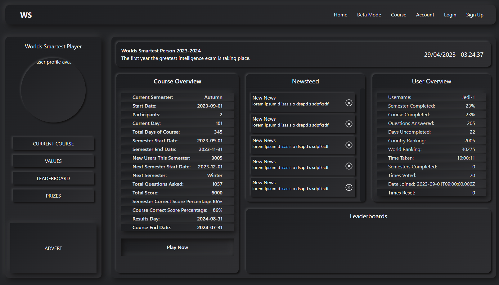

# Worlds Smartest Frontend

Quiz app. React front end

You can see a live version of the site here [Worlds Smartest Live Version](https://www.worlds-smartest.com)  
Backend is a python application that can be viewed here [Worlds Smartest Backend Repo](https://github.com/webdesignsbytom/worlds-smartest-backend)

[Temp Frontend](https://main--silly-vacherin-3026f4.netlify.app/)
[Temp Backend Host](https://worlds-smartest-frontend.vercel.app/)

## Table of contents

- [Worlds Smartest Frontend](#worlds-smartest-frontend)
  - [Table of contents](#table-of-contents)
  - [General info](#general-info)
  - [Main Features](#main-features)
    - [Neomorphic design and overview page](#neomorphic-design-and-overview-page)
  - [Technologies](#technologies)
  - [Run this project locally](#run-this-project-locally)

## General info

A quiz app that acts like a game and a serious IQ test.
Contests to see who is the smartest person
Scores can be adjusted by user votes.

Running temporary beta version test server on Express in this file.

## Main Features

### Neomorphic design and overview page

## Technologies

App developed with:  
Frontend: React, JavaScript, Tailwind, Axios, validator, bootstrap  
Backend: Python, Django, postgreSQL

## Run this project locally

1. Fork this repository and clone the fork to your machine.
2. Navigate to client and server files and run
3. `npm install`
4. `npm start`
